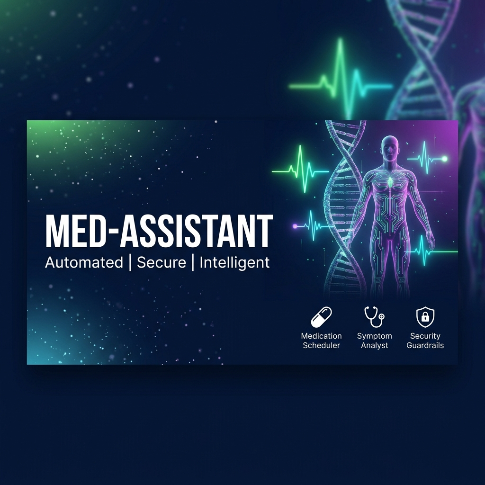
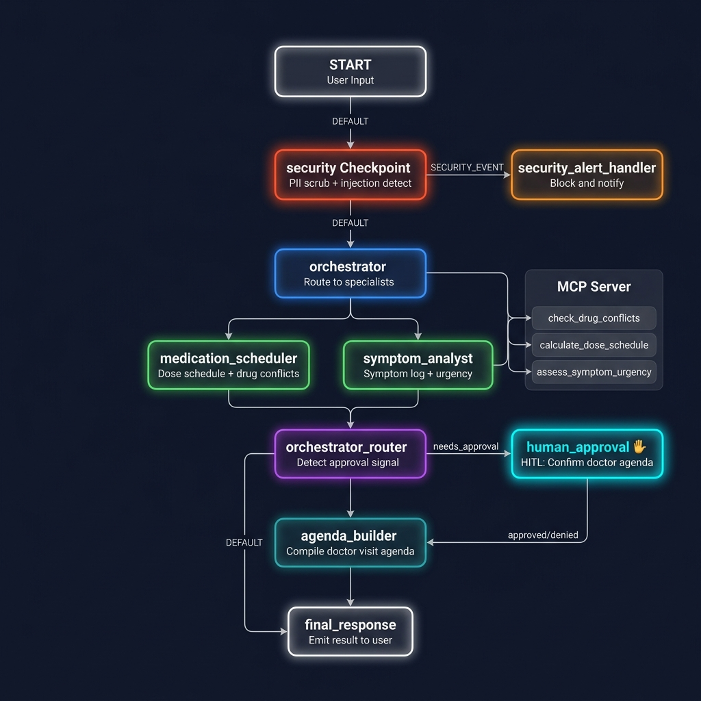
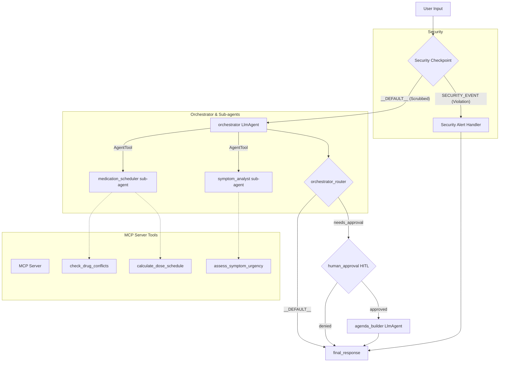

# Med-Assistant — Secure AI Medical Concierge Agent

A personal medical concierge assistant designed to schedule medication doses, track and analyze physical symptoms, and compile doctor visit summaries. Built securely on the Google Agent Development Kit (ADK) 2.0 Workflow API and Model Context Protocol (MCP).

## Assets





## Demo Script
See [DEMO_SCRIPT.txt](DEMO_SCRIPT.txt) for a full spoken walkthrough of the project.

## Prerequisites
* Python 3.11–3.13
* [uv](https://docs.astral.sh/uv/) (Python package manager)
* Gemini API key from [Google AI Studio](https://aistudio.google.com/apikey)

## Quick Start
```bash
git clone <repo-url>
cd med-assistant
cp .env.example .env   # add your GOOGLE_API_KEY
make install
make playground        # opens UI at http://localhost:18081
```

## System Architecture



## How to Run

* **Playground Mode**: Starts the local web playground for manual testing and conversation.
  ```bash
  make playground
  ```
  Opens interactive Web UI at `http://localhost:18081`.

* **Production/A2A Run Mode**: Starts the agent runner server for standard API integrations.
  ```bash
  make run
  ```

* **Test Suite**: Runs the pytests.
  ```bash
  make test
  ```

## Sample Test Cases

### Test Case 1: Medication Scheduling & Conflict Detection
* **Input**: `"I have a prescription for Aspirin 81mg QD starting at 8 AM. Can you schedule it and check for any conflicts?"`
* **Expected Behavior**: The orchestrator delegates to `medication_scheduler` which uses MCP tools to calculate dosage timing (`08:00`) and verify conflicts against the current list.
* **Check**: The user sees a formatted dosage schedule showing Aspirin at 08:00 with confirmation of no major conflicts in the playground UI.

### Test Case 2: Symptom Logging & Clinical Urgency Alerts
* **Input**: `"I've been experiencing severe chest pain and shortness of breath since this morning."`
* **Expected Behavior**: The orchestrator delegates to `symptom_analyst` which runs `assess_symptom_urgency` via MCP. It detects red-flags ("chest pain") and triggers a high-urgency severity path.
* **Check**: The user sees a high-severity critical alert message advising immediate emergency services.

### Test Case 3: Doctor Agenda Compile & HITL Approval
* **Input**: `"Please compile a doctor visit agenda for me."`
* **Expected Behavior**: The orchestrator returns a plan and flags `needs_approval`. The router redirects to `human_approval` which pauses the workflow and requests input.
* **Check**: The playground UI interrupts execution and displays: *“Do you approve compiling and generating your doctor visit agenda? (yes/no)”*. Submitting `"yes"` continues execution to output a formatted physician agenda compiled from state.

## Troubleshooting

1. **`ValidationError` when starting App**:
   * *Cause*: Incompatible `google-adk` version or incorrect field mapping (e.g., passing `resumability` instead of `resumability_config`).
   * *Fix*: Ensure `app/agent.py` instantiates `App` using `resumability_config=ResumabilityConfig(is_resumable=True)`.
2. **Subprocess MCP connection timeout / hangs**:
   * *Cause*: Python package import path conflicts or script path misresolution on Windows.
   * *Fix*: The path to `mcp_server.py` is resolved dynamically as an absolute script path and executed directly by `sys.executable`.
3. **No changes loaded after editing code (Windows)**:
   * *Cause*: The playground file watcher has locking issues with Windows subprocesses, disabling standard hot-reload.
   * *Fix*: Stop the server using `Get-Process -Id (Get-NetTCPConnection -LocalPort 18081, 8090 -ErrorAction SilentlyContinue).OwningProcess | Stop-Process -Force` and start it fresh.

## Demo Script
A spoken presentation script is available at `DEMO_SCRIPT.txt`. Refer to this document for a full run-through instructions.

## Assets
* Workflow Diagram: [architecture_diagram.png](file:///d:/adk-workspace/med-assistant/assets/architecture_diagram.png)
* Cover Banner: [cover_page_banner.png](file:///d:/adk-workspace/med-assistant/assets/cover_page_banner.png)

## Push to GitHub

1. Create a new repo at https://github.com/new
   - Name: med-assistant
   - Visibility: Public or Private
   - Do NOT initialize with README (you already have one)

2. In your terminal, navigate into your project folder:
   cd med-assistant
   git init
   git add .
   git commit -m "Initial commit: med-assistant ADK agent"
   git branch -M main
   git remote add origin https://github.com/KARRI-NAGA-DHENESH/med-assistant.git
   git push -u origin main

3. Verify .gitignore includes:
   .env          ← your API key — must NEVER be pushed
   .venv/
   __pycache__/
   *.pyc
   .adk/

⚠ NEVER push .env to GitHub. Your API key will be exposed publicly.
