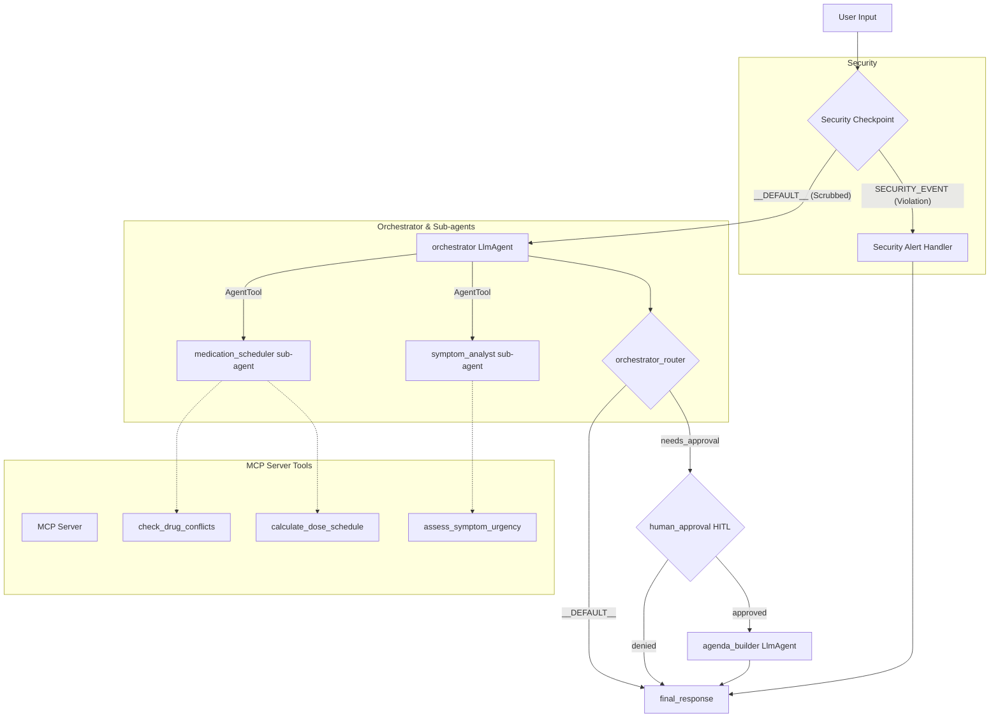

# Project Submission Write-Up: Med-Assistant

## Problem Statement
In personal healthcare management, patients frequently struggle with tracking complex medication regimens and logging physical symptoms accurately between clinical visits. Traditional journaling is prone to omissions, lacks instant safety checking for drug conflicts, and fails to screen symptom severity for urgent warnings. Patients need a secure, interactive assistant that registers daily details and converts them into structured, medical-grade agendas ready for consultation with their physician.

---

## Solution Architecture

---

## Concepts Used

1. **ADK Workflow (Graph API)**: The entire orchestration is built using the ADK 2.0 graph engine defined in [app/agent.py](file:///d:/adk-workspace/med-assistant/app/agent.py#L286-L327) using custom nodes and routing maps.
2. **LlmAgent**: Three specialized agents (`medication_scheduler`, `symptom_analyst`, `agenda_builder`) and one coordinator (`orchestrator`) are defined as `LlmAgent` instances in [app/agent.py](file:///d:/adk-workspace/med-assistant/app/agent.py#L90-L162).
3. **AgentTool**: The `orchestrator` uses `AgentTool` in [app/agent.py](file:///d:/adk-workspace/med-assistant/app/agent.py#L149) to delegate scheduling and symptom queries to the sub-agents while maintaining overall conversational state.
4. **MCP Server**: Implemented in [app/mcp_server.py](file:///d:/adk-workspace/med-assistant/app/mcp_server.py), exposing three domain-specific medical tools using standard stdio transport.
5. **Security Checkpoint**: Implemented as the first node in [app/agent.py](file:///d:/adk-workspace/med-assistant/app/agent.py#L182-L263), performing PII scrubbing, injection detection, and substance screening before executing LLMs.
6. **Agents CLI**: Project scaffolded with `agents-cli scaffold create` and configured via `agents-cli-manifest.yaml` and a `Makefile`.

---

## Security Design

The security layer in `Med-Assistant` uses several key controls to maintain data privacy and user safety:
* **PII Redaction**: Regular expressions target Phone numbers, Emails, and SSNs, replacing them with generic placeholders to prevent sensitive clinical records from being passed to external APIs.
* **Injection Detection**: Keywords targeting prompt injection techniques block harmful queries before they can execute.
* **Substance Safety Check (Custom Rule)**: Detects names of illicit/recreational substances (e.g. fentanyl, cocaine) or chemical synthesis questions.
* **Structured Auditing**: Every gate decision generates a JSON audit log output to `sys.stderr` with severity rankings (INFO, WARNING, CRITICAL) for administrative tracking.

---

## MCP Server Design

The Model Context Protocol (MCP) server runs locally and exposes the following tools:
1. `check_drug_conflicts`: Parses active lists of medications and checks for severe clinical contraindications (e.g., blood thinners + NSAIDs).
2. `calculate_dose_schedule`: Computes explicit daily timing lists (e.g., BID starting at 8 AM maps to `08:00`, `20:00`) for user calendar records.
3. `assess_symptom_urgency`: Screens symptoms for clinical red-flags (such as chest pain or breathing issues) to recommend emergency care immediately.

---

## Human-in-the-Loop (HITL) Flow

A `RequestInput` interrupt is placed in the graph within the `human_approval` node in [app/agent.py](file:///d:/adk-workspace/med-assistant/app/agent.py#L273-L289). 
This requires the user to explicitly confirm generation of the clinical visit agenda before the system compiles state records. Consent checks are crucial in digital health, and this pause ensures the user is in control of compile and print actions.

---

## Demo Walkthrough

The walkthrough follows the test cases detailed in the project's [README.md](file:///d:/adk-workspace/med-assistant/README.md):
1. **Medication Scheduling**: Calculates Aspirin schedule to 08:00 using the MCP scheduler tool.
2. **Symptom Logging & Emergency Alert**: Flags chest pain input, generating a critical emergency medical warning immediately.
3. **Agenda Compilation**: Pauses via HITL. Upon receiving `"yes"`, it reads the stored conversation log and outputs a structured agenda.

---

## Impact / Value Statement
`Med-Assistant` acts as a secure buffer between patients and healthcare systems. By automating symptom logging and schedule calculation locally under strict security guardrails, it improves prescription compliance and patient preparation for clinic visits. Physicians receive structured summaries, allowing them to optimize consulting hours and focus on critical diagnostic reasoning.
